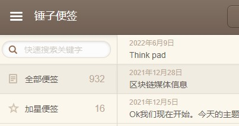

语言是人与人沟通的载体，从对一件事情的五官上的感觉，到之后加上我们后天从环境吸取的经验和教训，构成我们自己对人和事物的感受，对和我们自己有关的想法。

很久之前，我就有了做笔记的习惯，从中学记录老师课上讲的重点知识，关键解题办法，到大学看到好电影，好的书做的简单的影评和书评，再到工作恋爱，发生的一系列的各种情绪，各种想法。

这些年用来记录的工具也不断在变化，从最早的用纸和笔来写写画画，到后来用Ever Notes, Apple Notes,Typora, twitter 各种工具来写，想到什么就记录下来，不加情绪的记录发生在自己身上的事情，记录自己的情绪。

所以，这次又搭建了一个Blog 来记录自己。

---

我想用这个Blog来记录我自己真实的情绪，发生在我身上的事情，以及我所思考的事情。

哦，切回正题，写一个Blog的最少必要知识是什么呢?

> 文采?
>
> 文字数量？
>
> 持续更新？
>
> 博客美观度？

这也是个根据价值观选择的过程，我觉得最少必要知识是: 持续更新，输出新知。

那持续的频率呢? 我认为可以缓到3个月一次，新知的频率呢，我觉得还是要从我自己的认识来写。

我写的东西会非常的主观，甚至可能充满着各种偏见。但我的价值观是，我要对自己保持真诚，我拥有认识真实自己的能力，在认识到真实自己后，我来接纳这个有着各种缺点，弱点，有各种抽疯时刻的自我，接纳之后，不断的提高自我。

这其实是一种很“爽”的状态，因为在这个过程中，我们不断积累的是幸福。

